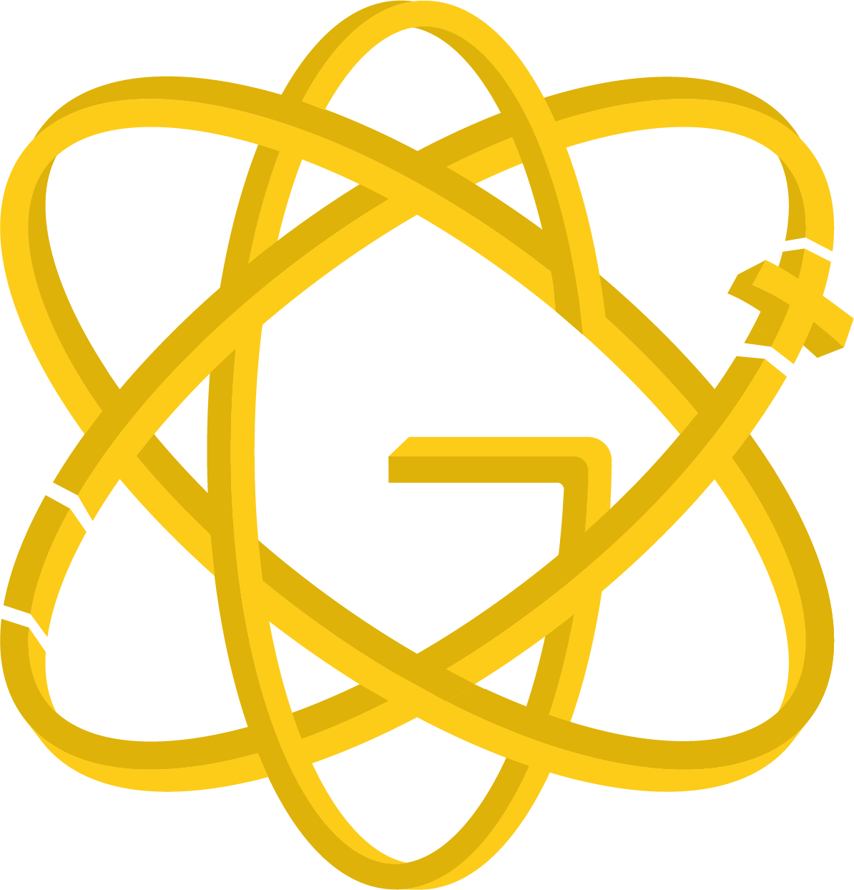

<!-- Don't delete it -->
<div name="readme-top"></div>

<!-- Organization Logo -->
<div align="center" style="display: flex; align-items: center; justify-content: center; gap: 24px;">
  
  
</div>

&nbsp;

<!-- Organization Name -->
<div align="center">

[](https://stability.nexus/)
&nbsp;&nbsp;
[](https://scorecard.dev/viewer/?uri=github.com/StabilityNexus/Gluon-LandingPage)

</div>

<!-- Organization/Project Social Handles -->
<p align="center">
<!-- Telegram -->
<a href="https://t.me/StabilityNexus">
</a>
&nbsp;&nbsp;
<!-- X (formerly Twitter) -->
<a href="https://x.com/StabilityNexus">
</a>
&nbsp;&nbsp;
<!-- Discord -->
<a href="https://discord.gg/YzDKeEfWtS">
</a>
&nbsp;&nbsp;
<!-- Medium -->
<a href="https://news.stability.nexus/">
  </a>
&nbsp;&nbsp;
<!-- LinkedIn -->
<a href="https://linkedin.com/company/stability-nexus">
  </a>
&nbsp;&nbsp;
<!-- Youtube -->
<a href="https://www.youtube.com/@StabilityNexus">
  </a>
</p>

&nbsp;

<!-- Project core values and objective -->
<p align="center">
  <strong>
  Gluon is a fully autonomous and fully backed stablecoin protocol. <br />
  Split any token into stable and volatile sub-tokens (minting stablecoins), merge these sub-tokens back into the original token (redeeming stablecoins), and transmute one sub-token into the other to adjust how much stability or leveraged volatility you wish to have.
  </strong>
</p>

---

<!-- Table of Contents -->
<details>
  <summary>Table of Contents</summary>
  <ul>
    <li><a href="#getting-started"> ➤ Getting Started</a></li>
    <!-- Don't delete it -->
    <li><a href="#project-technologies"> ➤ Project Technologies</a></li>
    <li>
      <a href="#commands-to-run-before-pushing-code"> ➤ Commands to run before pushing code</a>
      <ul>
        <li><a href="#first-command"> ➤ First Command</a></li>
        <li><a href="#second-command"> ➤ Second Command</a></li>
      </ul>
    </li>
    <li><a href="#learn-more"> ➤ Learn More</a></li>
  </ul>
</details>

<!-- Project Description (Start from here) -->

## **Getting Started**

First install the required packages by running:

```bash
npm install
```

Then, run the development server:

```bash
npm run dev
# or
yarn dev
# or
pnpm dev
```

Open [http://localhost:3000](http://localhost:3000) with your browser to see the result.

You can start editing the page by modifying `app/page.tsx`. The page auto-updates as you edit the file.

<!-- Use Back Button after each section -->
<div align="right"><kbd><a href="#readme-top">↑ Back to top ↑</a></kbd></div>

## **Project Technologies**

Technologies used:

- Next.js (App Router)
- Tailwind CSS
- Framer Motion

<!-- Use Back Button after each section -->
<div align="right"><kbd><a href="#readme-top">↑ Back to top ↑</a></kbd></div>

## **Commands to run before pushing code**

After you commit all your changes, run these commands and commit the changes for these commands before pushing the code to the repository.

### **First Command**

```bash
npm run lint
```

This command runs ESLint to check for any lint errors or formatting issues.

### **Second Command**

```bash
npm run build
```

This command runs Next.js build and TypeScript validation to ensure the static export builds successfully without errors.

<!-- Use Back Button after each section -->
<div align="right"><kbd><a href="#readme-top">↑ Back to top ↑</a></kbd></div>

## **Learn More**

To learn more about Next.js, take a look at the following resources:

- [Next.js Documentation](https://nextjs.org/docs) - learn about Next.js features and API.
- [Learn Next.js](https://nextjs.org/learn) - an interactive Next.js tutorial.

You can check out [the Next.js GitHub repository](https://github.com/vercel/next.js/) - your feedback and contributions are welcome!

<!-- Use Back Button after each section -->
<div align="right"><kbd><a href="#readme-top">↑ Back to top ↑</a></kbd></div>
